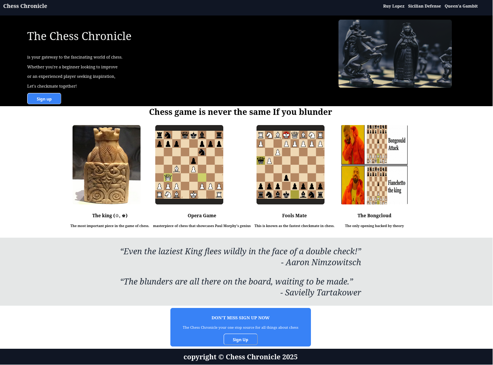

# 🖥️ Landing Page 

This is a **Landing Page** project completed as part of the [Foundations Course](https://www.theodinproject.com/lessons/foundations-landing-page) from  **The Odin Project**.

## Live prev
[Live prev](https://mx-99.github.io/landing_page/)

#### 🚀 What I Built

A static landing page using **HTML** and **CSS**, replicating a sample design provided in the project. 
The focus was on layout, visual structure, and styling not on functionality or interactivity.

#### 🎯 Project Objectives

- Recreate a web page from design images.
- Practice using:

  - Semantic HTML structure
  - CSS Flexbox for layout

#### 🛠️ Skills & Tools Used

- HTML5
- CSS3 (with Flexbox)
- Developer Tools for debugging and layout inspection

#### ✨ Notes

- This is not meant to be a pixel-perfect clone.
- The images on this page are from a collection I gathered from the internet a while ago.  
Unfortunately, I have forgotten the sources.
If you own one, two, or more of the images,   Feel free to contact me to be credited or to have them removed.